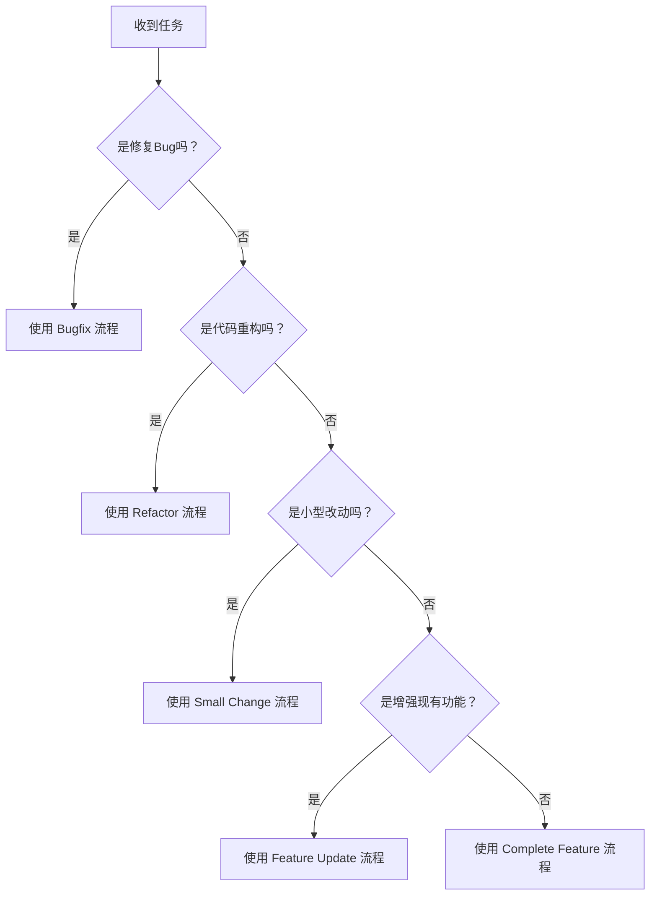

# 工作流程指南

本文档提供了工作流程的分类说明、决策树和常见问题处理方法。

---

## 工作流程分类

根据任务复杂度和范围，我们将开发任务分为五类：

| 类型 | 定义 | 示例 |
|------|------|------|
| **Bugfix** | 修复现有功能的缺陷 | 修复类型错误、修复逻辑错误、修复 API 调用问题 |
| **Small Change** | 小型功能调整或优化 | 添加新的筛选项、调整 UI 布局、添加新的工具函数 |
| **Feature Update** | 现有功能的增强或扩展 | 支持新的广告平台、增加批量操作、扩展现有 Manager |
| **Complete Feature** | 全新功能模块开发 | 新增广告创意分析模块、用户权限系统 |
| **Refactor** | 代码重构和优化 | 提取重复组件、重构 Manager 结构、优化代码组织 |

---

## 决策树：我该使用哪个工作流程？

---

## 常见问题处理

### 问题 1：类型错误
1. 运行类型检查查看具体错误
2. 读取类型错误详情
3. 检查类型定义是否正确
4. 检查导入导出是否正确

### 问题 2：Lint 错误
1. 运行代码格式检查和代码质量检查
2. 读取错误详情
3. 根据错误信息修复代码
4. 如果项目有自动修复命令，可以使用

### 问题 3：找不到相关代码
1. 进行语义搜索查找相关代码
2. 搜索关键词查找具体位置
3. 查看项目目录结构理解组织方式
4. 阅读相关规则文档理解架构模式

### 问题 4：不确定实现方式
1. 搜索项目中类似的实现
2. 查看项目的规则文档（如 `architecture.md`）
3. 查看现有代码的模式
4. 遵循项目的架构标准

### 问题 5：Spec 设计不完整
1. 重新分析需求，补充遗漏的功能点
2. 重新分析代码结构，补充遗漏的模块
3. 重新设计架构，确保所有依赖关系清晰
4. 只有在 Spec 完整后才能开始编码

